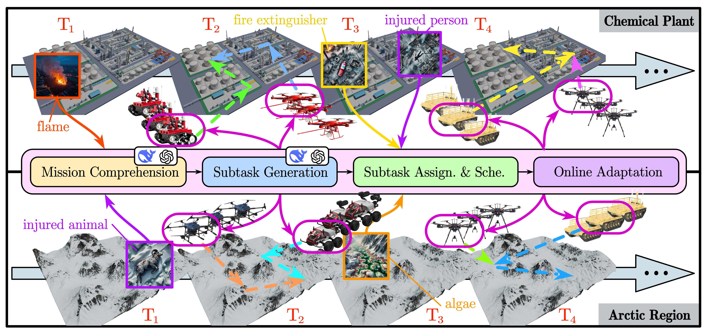

<p align="center">
    
    
    
    
    
</p>

# DEXTER-LLM 🚀

## Project Overview

DEXTER-LLM *(Dynamic and Explainable Coordination of Multi-Robot Systems in Unknown Environments via Large Language Models)* is a novel framework for dynamic long-term task planning in heterogeneous multi-robot systems, designed to operate in unknown environments. By integrating Large Language Models (LLMs) for real-time reasoning and model-based optimization for task scheduling, DEXTER-LLM achieves adaptive task decomposition, optimal assignment, and robust execution.



👉 [Project Homepage](https://tcxm.github.io/DEXTER-LLM/)

## Key Features

- 🛠️ **Dynamic Task Decomposition**  
  Real-time task decomposition using LLMs to generate executable subtasks based on environmental observations.
  
- ⏰ **Optimal Task Scheduling**  
  Optimal assignment of subtasks to robots considering heterogeneous capabilities and resource constraints.
  
- 🔁 **Multi-Rate Adaptation**  
  Event-driven adaptation to new features and tasks detected online, ensuring continuous planning and execution.
  
- 📝 **Explainability & Verifiability**  
  Human-in-the-loop verification and explainable planning through search-based scheduling and explicit constraints.
  
- 🌐 **Scalability & Versatility**  
  Supports large-scale deployments with multiple robots and complex missions.

## ⚙️ Installation

1. Clone the repository with `--recursive`:
    ```bash
    git clone --recursive https://github.com/tcxm/DEXTER-LLM.git
    ```
2. Download .dae and .pcd files and save them to `src/test/files`:\
    ```bash
    pip install gdown
    cd src/test/files
    gdown --id 1V2Bmm1WEoNbUUAUHH3IK0liN2aal7qyT
    gdown --id 1NmSnhFpppiwsUXZJgvqnwSe8FTANRkW3
    gdown --id 1efqZVtdo03o3a3aRRimai8UAUKuGSAaG
    gdown --id 1e_D1Q8BDsXBCWKjG14l7jcCbgHtyIzFV
    cd ../../..
    ```

3. Download requirements:
    - ROS Noetic
    - jsk_rviz_plugins
        ```bash
            sudo apt install ros-noetic-jsk-rviz-plugins
            sudo apt install libarmadillo-dev
        ```
    - python reqs
        ```bash
            pip install -r requirements.txt
        ```

4. Catkin make:
    ```bash
    catkin_make
    ```

## 🚀 Quick Start

Run the following command one by one in seperate terminals:

Chemical Plant Simulation:

```bash
source devel/setup.bash && roslaunch test rviz.launch
source devel/setup.bash && roslaunch test map.launch
source devel/setup.bash && roslaunch test sim.launch
source devel/setup.bash && roslaunch test test.launch
```

Arctic Region Simulation:

```bash
source devel/setup.bash && roslaunch test rviz.launch
source devel/setup.bash && roslaunch test map_ice.launch
source devel/setup.bash && roslaunch test sim_ice.launch
source devel/setup.bash && roslaunch test test_ice.launch
```

⚠️Note: After running map.launch, wait until map is displayed in rviz.

## LLM Setup

1. Configure your LLM endpoint and credentials in [src/task_gen_llm/scripts/task_gen_client.py](src/task_gen_llm/scripts/task_gen_client.py):
  - `BASE_URL =`
  - `MODEL =`
  - `API_KEY =`

2. To enable real LLM calls, set `mode` to `auto` in [src/test/launch/test.launch](src/test/launch/test.launch) or [src/test/launch/test_ice.launch](src/test/launch/test_ice.launch) for node `task_gen_manager`.

3. Default `preset` mode uses ground-truth responses (from preset files) instead of calling the LLM, so users can quickly see the full pipeline effect without LLM configuration.

## Contact Us

- [Yuxiao Zhu](mailto:yuxiao.zhu@dukekunshan.edu.cn)
- [Junfeng Chen](mailto:chenjunfeng@stu.pku.edu.cn)
- [Xintong Zhang](mailto:xintong.zhang@dukekunshan.edu.cn)
- [Meng Guo](mailto:meng.guo@pku.edu.cn)
- [Zhongkui Li](mailto:zhongkli@pku.edu.cn)
